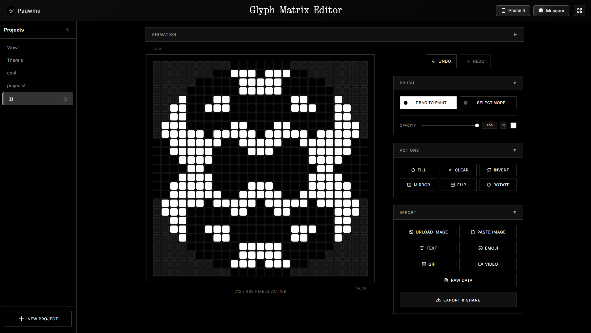

# Glyph Matrix Editor

A free, open-source animation editor for creating Nothing Phone (3) and Phone (4a) Pro Glyph Matrix animations and icons.

## ✨ Features

🎨 **Drawing & Editing**
- Brush, eyedropper, fill, clear, invert, mirror, flip, rotate
- Selection mode with move, copy, and paste
- Undo/redo history

📂 **Multi-project**
- Work on multiple designs simultaneously
- Auto-save with session restore

🎬 **Animation**
- Frame-by-frame timeline with configurable duration
- Onion skin with adjustable opacity
- Playback modes: once, reverse, ping-pong

📥 **Import**
- Images, GIFs, video, clipboard paste
- Text-to-pixel with 3 built-in pixel fonts (Ndot, NType, Ranyth)
- Emoji-to-pixel with search
- Raw binary data
- Brightness, contrast, and threshold controls

📤 **Export**
- 🖼️ Images: PNG, JPEG, WebP, SVG, ICO (with scale, background, and shape options)
- 🎞️ Animations: GIF, WebM, MP4, Lottie JSON
- 💾 Data: JSON, Pixel Data, JavaScript Array
- 🔘 Glyph Toy/Tool rounded icon style
- 📲 Ready to upload to Nothing Playground

## 🎨 Community Creations

  

## 🆕 Latest Update

- 📱 **Phone (4a) Pro support**: New device resolution with auto-adapting grid
- 📂 **Multi-project management**: Create, switch, and auto-save multiple projects
- 👻 **Onion skin**: See previous frames while animating with adjustable opacity
- 🔄 **Playback modes**: Play once, reverse, and ping-pong preview
- 🎞️ **Lottie JSON export**: Export animations directly for Nothing Playground
- 📹 **Video import**: Import video files as animation frames

## 👥 Contributors

Thanks to these amazing people for their contributions:

- [Rahul Janardhanan](https://x.com/raonehere) - Project management, playback modes, onion skin, video import

 

---

 

**[⭐ Star this project](https://github.com/pauwma/GlyphMatrixEditor)** if you find it useful!

Made with 🤍 for the Nothing community

